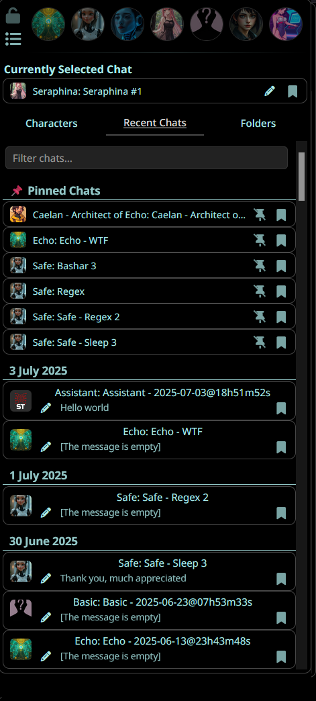
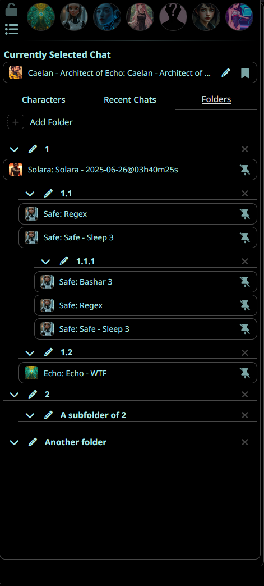
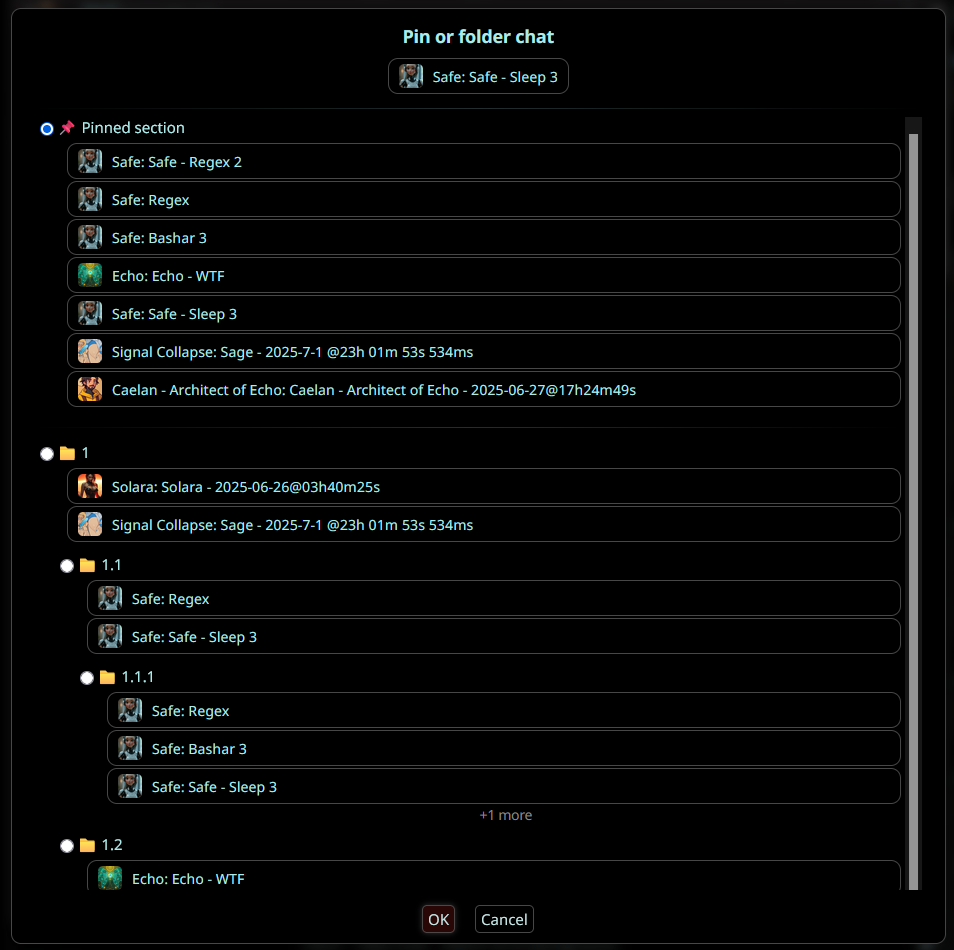
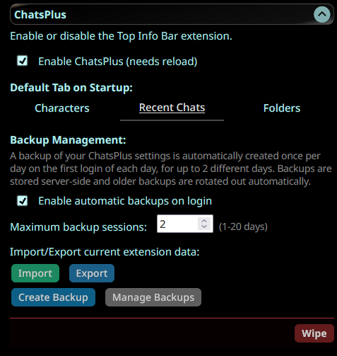
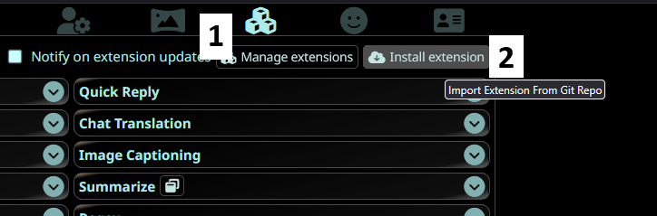

# ChatsPlus - Recent, Pinned and Folders for Chats in SillyTavern

SillyTavern is a wonderful tool but very Character-centric, making managing conversations across characters cumbersome. ChatsPlus provides a Chat-centric interface integrated into SillyTavern's UI to address that speed bump.

## Features Overview

### Main Interface & Organization

| Recent and Pinned Chats                        | Folder Organization                          |
| ---------------------------------------------- | -------------------------------------------- |
|  |  |

The extension integrates directly into your "Character Management" tab, providing recent chats, search, pinned chats and folders all in the same place. View all your conversations in an organized, easy-to-navigate folder structure with unlimited subfolder organization.

### Chat Management & Customization

| Pin Your Chats                                    | Search Functionality                          | Extension Settings                            |
| ------------------------------------------------- | --------------------------------------------- | --------------------------------------------- |
|  |  |  |

Pin important chats for quick access, search across character names, chat titles, and last message content. The settings menu allows you to customize your experience with startup tab preferences and data backup and exporting options.

## Summary

Switching to a char on another character?
From: "Clicking the new character > 'Manage Character Files' > 'Pray you gave it a decent name to find it' > Click to load it"
To: "Recent Chats/Folders > Find your pinned or foldered chat and click it"

Your order, your way.

- **Tabbed Character Management:** Quickly switch between Characters, Recent Chats, and Folders.
- **Recent Chats View:** See your chats ordered by 'most recent first' in one place.
- **Advanced Search:** Easily find specific chats by character name, chat title, or last message content.
- **Folders for Chats:** Organize your chats into custom folders and subfolders.
- **Pin Chats:** Pin important chats for quick retrieval.
- **Integrated Settings UI:** Manage extension settings directly from the SillyTavern extensions menu.
- **Customizable Startup Tab:** Choose which tab (Characters, Recent, Folders) is active on startup.
- **Import/Export Data:** Backup or transfer your ChatsPlus data with simple import/export options.

## Installation

Use this URL with the extension installer: `https://github.com/SoFizzticated/SillyTavern-ChatPlus`

## Known Issues

- **Renaming a chat**: Renaming a chat from OUTSIDE the ChatsPlus interface may break the internal organization structure! This is due to a limitation on the events SillyTavern emits when renaming a chat. If you rename a chat, please do so from within the ChatsPlus interface to ensure the folder structure remains intact or export your extension data from the "Settings" menu to edit and fix it manually.
- **Yes, it is stitched together**: The extension is stitched together which means sometimes things break. In those cases, please reload the page and it should fix itself. If not, please report the issue on the extension thread in the SillyTavern Discord server.

## Thank you

If you appreciate this plugin make sure to thank these great contributors too, it wouldn't be possible without them!

### To RivelleDays
- For the style improvements. If this extension looks nice make sure to thank them too!
- For the "SillyTavern-FriendlyUI" plugin that served as a reference for this plugin

### To Cohee1207
- For their "Extension-TopInfoBar" plugin which served as the base of this plugin

And to you for contributing and being a part of this great community :)

---

### Created by SoFizzticated
- Feel free to reach out with any questions or suggestions on the extension thread by the SillyTavern Discord server. Otherwise I'm starfish_galaxy on discord or you can hit me up by email.

## License

AGPLv3

---

_Enhance your SillyTavern experience with **your** chat organization and management!_
