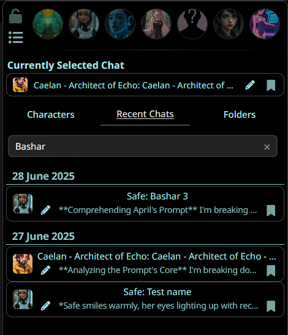

# ChatsPlus

Switching to a char on another character?
From: "Clicking the new character > 'Manage Character Files' > 'Pray you gave it a decent name to find it' > Click to load it"
To: "Recent Chats/Folders > Find your pinned or foldered chat and click it"

Your order, your way.

## Overview

SillyTavern is a wonderful tool but very Character-centric, making managing conversations across characters cumbersome. ChatsPlus provides a Chat-centric interface integrated into SillyTavern's UI to address that speed bump.

- **Tabbed Character Management:** Quickly switch between Characters, Recent Chats, and Folders.
- **Recent Chats View:** See your chats ordered by 'most recent first' in one place.
- **Advanced Search:** Easily find specific chats by character name, chat title, or last message content.
- **Folders for Chats:** Organize your chats into custom folders and subfolders.
- **Pin Chats:** Pin important chats for quick retrieval.
- **Integrated Settings UI:** Manage extension settings directly from the SillyTavern extensions menu.
- **Customizable Startup Tab:** Choose which tab (Characters, Recent, Folders) is active on startup.
- **Import/Export Data:** Backup or transfer your ChatsPlus data with simple import/export options.

## Installation

Use this URL with the extension installer: `https://github.com/SoFizzticated/SillyTavern-ChatPlus`

## Features Overview

### Main Interface & Organization

| Main Interface                                 | Recent Chats & Organization                  |
| ---------------------------------------------- | -------------------------------------------- |
|  |  |

The extension integrates directly into your "Character Management" tab, providing recent chats, search, pinned chats and folders all in the same place. View all your conversations in an organized, easy-to-navigate folder structure with unlimited subfolder organization.

### Chat Management & Customization

| Pin Your Chats                                    | Search Functionality                          | Extension Settings                            |
| ------------------------------------------------- | --------------------------------------------- | --------------------------------------------- |
|  |  |  |

Pin important chats for quick access, search across character names, chat titles, and last message content. The settings menu allows you to customize your experience with startup tab preferences and data backup and exporting options.

## Author

Created by SoFizzticated.
Feel free to reach out with any questions or suggestions on the extension thread by the SillyTavern Discord server. Otherwise I'm starfish_galaxy on discord or you can hit me up by email.

## License

AGPLv3

---

_Enhance your SillyTavern experience with **your** chat organization and management!_
