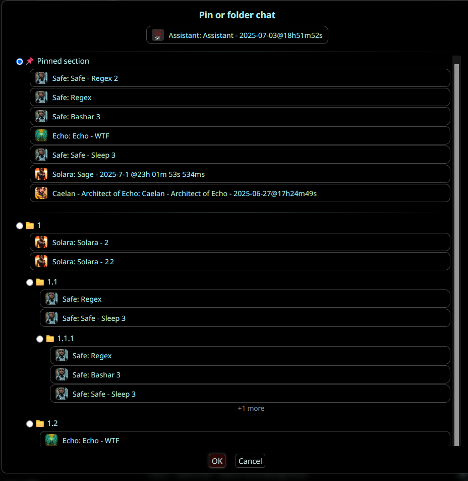

# ChatsPlus

Switching to a char on another character?
From: "Clicking the new character > 'Manage Character Files' > 'Pray you gave it a decent name to find it' > Click to load it"
To: "Recent Chats/Folders > Find your pinned or foldered chat and click it"

Your order, your way.

## Overview

SillyTavern is a wonderful tool but very Character-centric, making managing conversations across characters cumbersome. ChatsPlus provides a Chat-centric interface integrated into SillyTavern's UI

- **Tabbed Character Management:** Quickly switch between Characters, Recent Chats, and Folders.
- **Recent Chats View:** See your chats ordered by 'most recent first' in one place.
- **Advanced Search:** Easily find specific chats by character name, chat title, or last message content.
- **Folders for Chats:** Organize your chats into custom folders and subfolders.
- **Pin Chats:** Pin important chats for quick retrieval.
- **Integrated Settings UI:** Manage extension settings directly from the SillyTavern extensions menu.
- **Customizable Startup Tab:** Choose which tab (Characters, Recent, Folders) is active on startup.
- **Import/Export Data:** Backup or transfer your ChatsPlus data with simple import/export options.

## Installation

Use this URL with the extension installer: `https://github.com/SoFizzticated/SillyTavern-ChatPlus`

## Features Overview

### Main Interface

The ChatsPlus extension adds a modern tabbed interface to your SillyTavern character management, making it easy to navigate between different views and organize your conversations.

### Recent Chats & Organization

View all your recent conversations in an organized list, with easy access to your most frequently used chats.

### Chat Pinning

Pin important chats to keep them at the top of your list for quick access. Perfect for your favorite characters or ongoing storylines.

### Advanced Search

Quickly find specific chats using the built-in search feature. Filter by character name, chat title, or content to locate exactly what you need.

### Settings & Configuration

Customize your ChatsPlus experience with comprehensive settings:

- Choose your default startup tab
- Configure folder behaviors
- Manage import/export options
- Control pinning preferences

## Usage

### Basic Navigation

- Access the ChatsPlus tabs from the Character Management menu
- Switch between Characters, Recent, and Folders tabs
- Use the search bar to quickly find specific chats

### Managing Chats

- **Pin chats**: Click the pin icon to keep important chats at the top
- **Create folders**: Use the Folders tab to organize your conversations
- **Filter content**: Use the search functionality to find specific chats by name or character

### Data Management

- **Export data**: Backup your ChatsPlus configuration and folder structure
- **Import data**: Restore or transfer your settings to another installation
- **Wipe data**: Reset all ChatsPlus data while preserving your actual chat content

## Author

Created by SoFizzticated

## License

AGPLv3

---

_Enhance your SillyTavern experience with better chat organization and management!_
